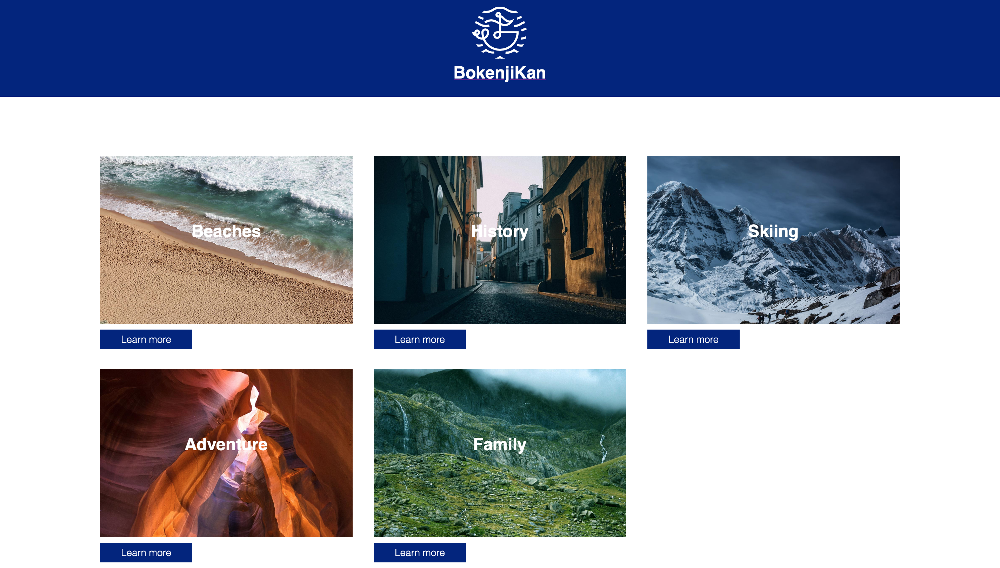
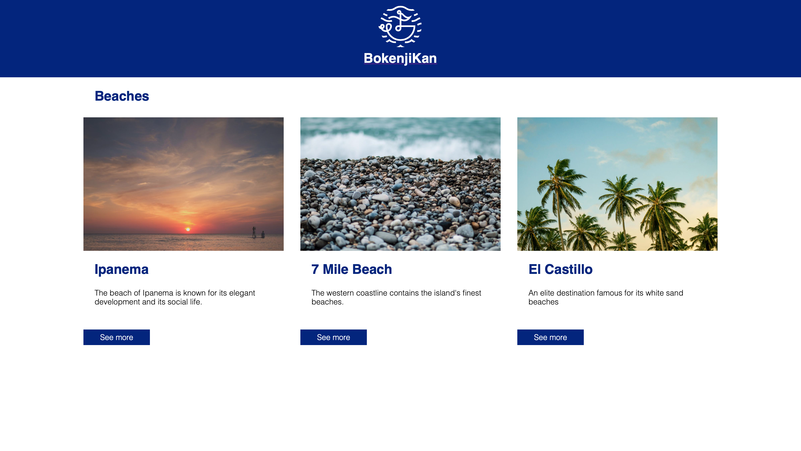
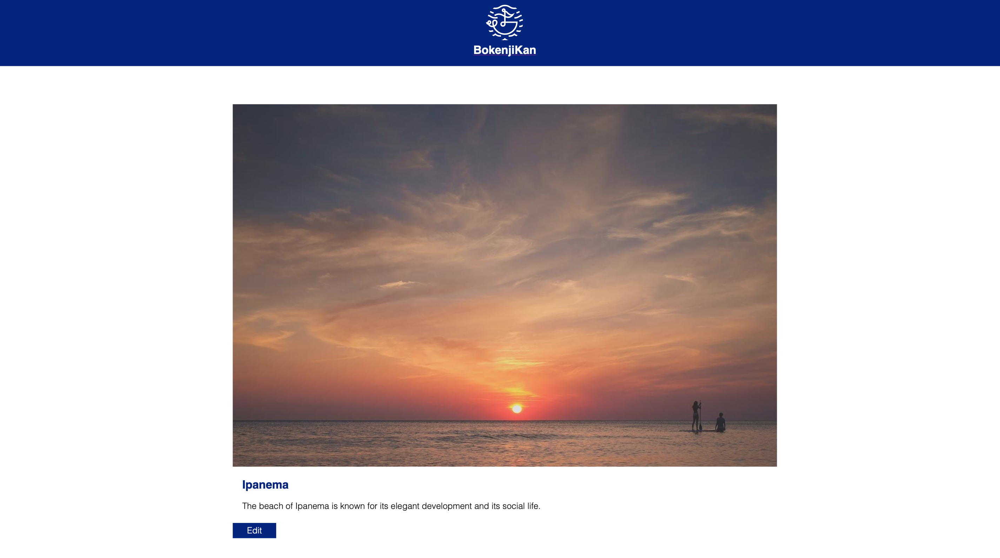
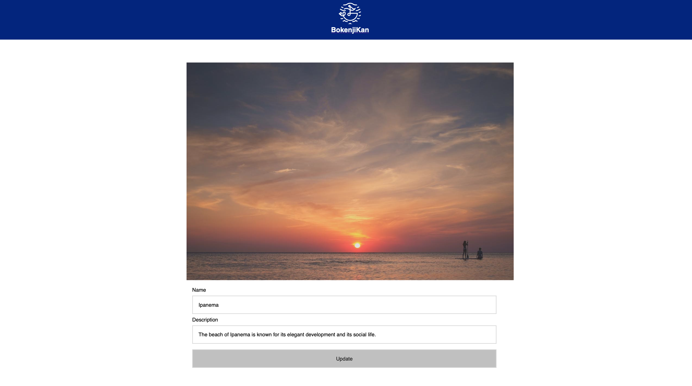
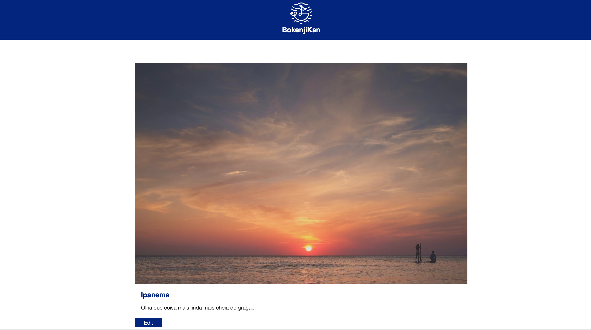

# Travel App

A dynamic Rails app based on the course Learn Ruby on Rails from Codecademy.

## Installation

Run `bundle install` to install the project dependencies.

## Starting the app

Run `rails server` to start the app locally.

## Configuring the database

Run `rake db:migrate && rake db:seed` to migrate and seed the database.

### Accessing the app locally

After the rails server is started and the database is configured, access the following URL in your preferable web browser: http://localhost:3000/tags

You should see something like the below samples.

